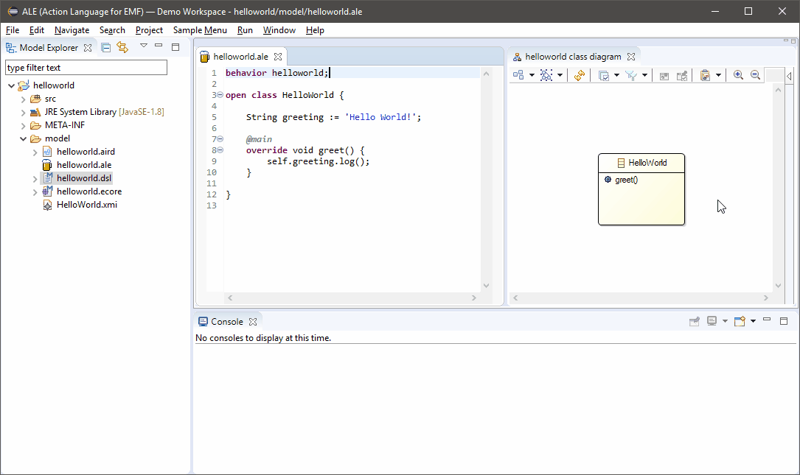

<h1 align="center">
	<a name="logo" href="https://gemoc.org/ale-lang"></a>
</h1>
<h3 align="center">
	Breathe life into your Ecore metamodels!
</h3>
<div align="center">
	<h4>
		<a href="http://gemoc.org/ale-lang"></a>
		<a href="https://img.shields.io/jenkins/build?jobUrl=https%3A%2F%2Fci.inria.fr%2Fgemoc%2Fjob%2Fale-lang%2Fjob%2Fmaster"></a>
		<a href="http://www.kermeta.org/ale-lang/updates/latest/"></a>
	</h4>
</div>

<div align="center">
	
</div>
<br/>
<p align="justify">
ALE <em>(Action Language for EMF)</em> is an interpreted language to define behaviors on the top of Ecore models and make them executable. Concretely, ALE allows to “re-open” EClasses with the aim of implementing existing EOperations and weaving new attributes or new operations.
</p>

## Main features

<p>
  	<ul>
		<li align="justify"><strong>Executable metamodeling</strong>: re-open existing EClasses to insert new methods along with their implementations</li>
	  	<li align="justify"><strong>Metamodel extension</strong>: the very same mechanism can be used to extend existing Ecore metamodels and insert new features (e.g. attributes) in a non-intrusive way</li>
	  	<li align="justify"><strong>Quick iterations</strong>: no need to deploy Eclipse plugins, just execute a model directly in your modeling environment</li>
	  	<li align="justify"><strong>Extensibility</strong>: if ALE doesn’t fit your needs, register Java classes as services and invoke them inside your implementations of EOperations.</li>
	</ul>
</p>

## Usage

<p align="justify">
ALE allows to easily define the behavior of an Ecore model and to test it on the spot, right in your modeling environment. It is not production-ready yet but allows for quick iterations and fast feedbacks. As such it is ideal for prototyping a solution.
</p>

[See the tutorials](http://gemoc.org/ale-lang/tutorial.html) for concrete examples.

## Code example

ALE is an interpreted, strongly typed an object-oriented language. It is based on [AQL](https://www.eclipse.org/acceleo/documentation/) which means that any valid AQL expression is a valid ALE expression.

The following snippet is part of the [Hello World example project](http://gemoc.org/ale-lang/first_steps.html) and prints `Hello World!` when executed:

```kotlin
behavior helloworld;

open class HelloWorld {

    @main
    override void greeting () {
        'Hello World!'.log();
    }

}
```

Please [see the online documentation](http://gemoc.org/ale-lang/reference.html#syntax-description) for an in-depth presentation of the language.

## Installation

<details>
  <summary><b>Show detailed instructions</b></summary>

  1. Open Eclipse IDE
  2. Go to *Help > Install New Software...*
  3. Copy the update site’s URL in the *Work with* textbox:
     	- http://www.kermeta.org/ale-lang/updates/latest/
  4. Hit *Enter* and wait for the list to load
  5. Check *Action Language for EMF*
  6. Click *Next* then *Finish*
</details>

ALE can be installed from its update site: http://www.kermeta.org/ale-lang/updates/latest/

> :information_source: nightly resulting from the last successful build in the CI

## Documentation


[ALE's website](http://gemoc.org/ale-lang/reference.html#syntax-description) provides:
 - [a language overview](http://gemoc.org/ale-lang/first_steps.html) (Hello World)
 - [a tutorial](http://gemoc.org/ale-lang/tutorial.html) where you learn how to make a state machine executable
 - [a comprehensive guide of ALE's syntax](http://gemoc.org/ale-lang/reference.html) 

## Contributing

<details>
  <summary><b>Setup your dev environment</b></summary>

  1. Clone the repository `git clone https://github.com/gemoc/ale-lang.git`
  2. Import all projects in Eclipse IDE
  3. Open the `releng/*.target/*.target` file
  4. Click on *Set as Target Platform*
  5. Wait for dependencies to be loaded
</details>

<details>
  <summary><b>Technical documentation</b></summary>

  ALE's architecture is presented in [plugins/README.md](plugins/README.md); further documentation will be provided as soon as possible.
</details>

[See the contributing guide](CONTRIBUTING.md) for further details.

## Publications

ALE is the result of research conducted at [Inria's DiverSE team](https://www.diverse-team.fr/). It is used to define Domain-Specific Languages (DSLs): the Ecore model and the ALE source files being respectively the abstract syntax and the semantics of those DSLs.

See below for a list of related publications:

 - Manuel Leduc, Thomas Degueule, Benoit Combemale, Tijs van der Storm, Olivier Barais<br/>
   **Revisiting Visitors for Modular Extension of Executable DSMLs**<br/>
   *In 2017 ACM/IEEE 20th International Conference on Model Driven Engineering Languages and Systems (MODELS)*<br/>
   [[Publication at IEEE Xplore Digital Library](https://ieeexplore.ieee.org/abstract/document/8101255)]

