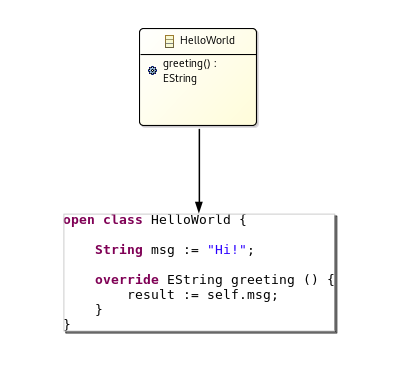

# ale-lang

ALE (Action Language for EMF) is an interpreted language to define behaviors on the top of Ecore metamodels. In other words, it makes Ecore metamodels executable.

<div align="center">
	
</div>

## Overview

Concretely, ALE allows to “re-open” the EClasses from Ecore metamodels to implement existing EOperations and weave new features or new operations.

#### Usage

1. Create a new modeling project
2. Fill the Ecore metamodel
3. [Activate ALE](http://gemoc.org/ale-lang/tutorial.html#implementation)
4. Define the behavior as an ALE script
5. Launch the ALE interpreter

#### Code example

The following ALE snippet is part of the [Hello World example project](http://gemoc.org/ale-lang/first_steps.html) and prints `Hello World!` when executed:

```
behavior helloworld;

open class HelloWorld {

	@main
	override void greeting () {
		'Hello World!'.log();
	}

}
```

#### ALE's main features

 - **Executable metamodeling**: Re-open existing EClasses to insert new methods with their implementations
 - **Metamodel extension**: The very same mechanism can be used to extend existing Ecore metamodels and insert new features (e.g. attributes) in a non-intrusive way
 - **Interpreted**: No need to deploy Eclipse plugins, just run the behavior on a model directly in your modeling environment
 - **Extensible**: If ALE doesn’t fit your needs, register Java classes as services and invoke them inside your implementations of EOperations.

> Check the [documentation](http://gemoc.org/ale-lang/) for further details.

Doc
===
* [Website](http://gemoc.org/ale-lang/)
* [Continous integration](https://ci.inria.fr/gemoc/job/ale-lang)
* [Update site](https://ci.inria.fr/gemoc/job/ale-lang/lastSuccessfulBuild/artifact/releng/org.eclipse.emf.ecoretools.ale.updatesite/target/repository/) (nightly) resulting from the last successfull build in the CI.


