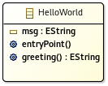

First steps
===========

Get the HelloWorld example
--------------------------

Available here: https://github.com/gemoc/ale-lang/tree/master/examples/helloworld

//TODO: make a downloadable .zip

What we have inside
-------------------

The interesting files of the `helloworld` project are inside the folder `model`:

* `HelloWorld.aird`<br>
  Graphical representation of `HelloWorld.ecore`
* `HelloWorld.ale`<br>
  Semantic for `HelloWolrd.ecore`
* `HelloWorld.dsl`<br>
  Do the link between `HelloWolrd.ecore` and `HelloWorld.ale`
* `HelloWorld.ecore`<br>
  Metamodel scribing the EClass HelloWorld
* `HelloWorld.xmi`<br>
  Instance of the EClass HelloWorld

By openning `HelloWorld.aird` you will see:



All members of HelloWorld are bold since they are defined inside `HelloWorld.ale` which looks like:

```
behavior HelloWorld;

open class HelloWorld {
	
	String msg := 'Hello world!';
	
	override EString greeting () {
		result := self.msg;
	}
	
	@main
	def void entryPoint() {
		self.greeting().log();
	}
}
```
We are implementing the EOperation `greeting()` by returning the value of `msg`.<br>
`msg` is a runtime data since it is defined inside `HelloWorld.ale` and not `HelloWorld.ecore`

`entryPoint()` is a new operation added to the EClass `HelloWorld` and is declared as the entry point for the execution thanks to `@main`

Run!
----

To launch the execution do a right click on `HelloWolrd.dsl` and select `Run As > Ale Launch`<br>
Then type `*xmi` and select `HelloWorld.xmi`

The console will show the result:

```
Run HelloWorld.dsl
------------
Hello world!
```

To go further have a look to the [MiniFsm tutorial](tutorial.html) or the [Reference page](reference.html)

