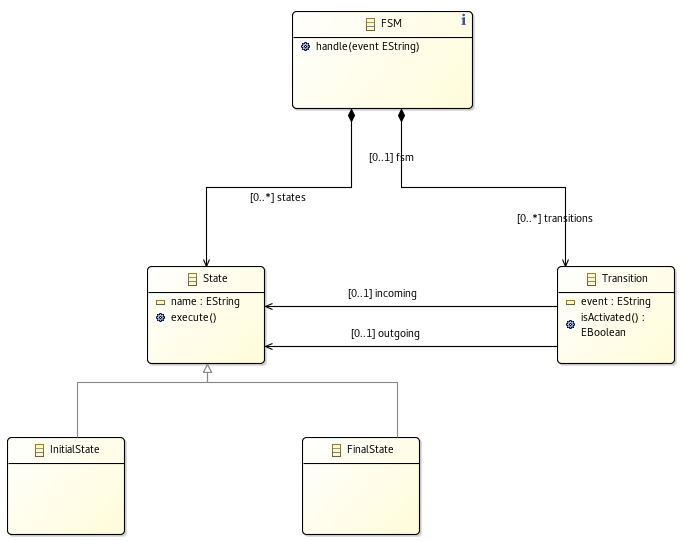
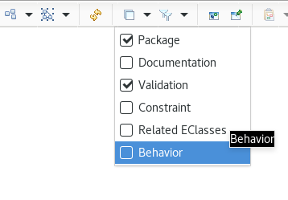
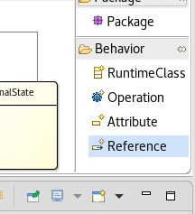
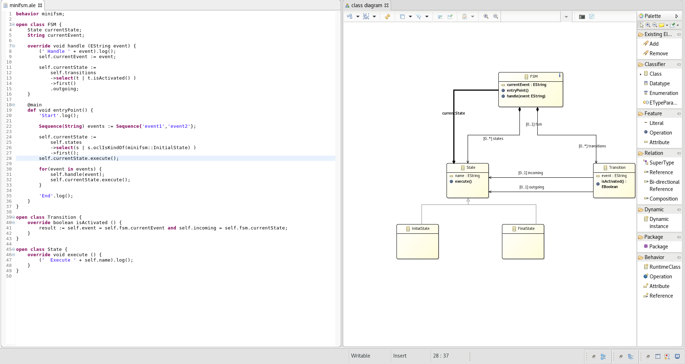
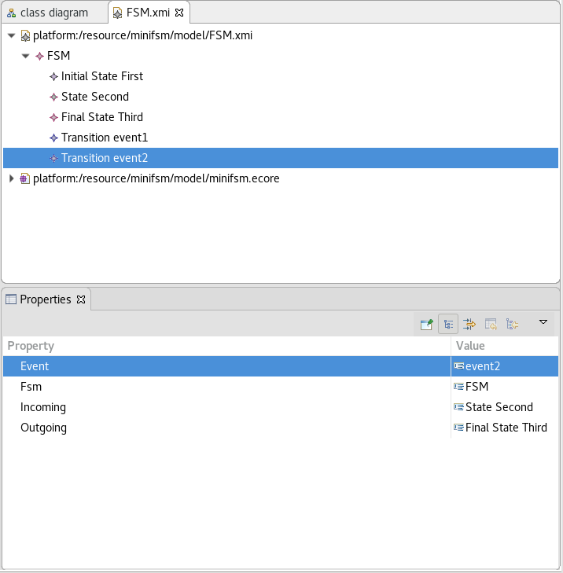

MiniFSM tutorial


In this tutorial you will learn how to make an executable language from scratch.

1. We will start by creating a Finite State Machine metamodel with EMF
2. We will then write a simple interpreter in ALE

Metamodel
=========

In this section we will create the abstract syntax of our language as an Ecore model.

Finite State Machine
--------------------

First of all, we need to define the domain of our language. 

So what is a FSM?

[Wikipedia’s definition](https://en.wikipedia.org/wiki/Finite-state_machine):
>is a mathematical model of computation. It is an abstract machine that can be in exactly one of a finite number of states at any given time. The FSM can change from one state to another in response to some external inputs; the change from one state to another is called a transition. A FSM is defined by a list of its states, its initial state, and the conditions for each transition.


Create Ecore model
------------------

1. `File > New > Project...`<br>
   `Eclipse Modeling Framework > Empty EMF Project > Next`
2. Fill `Project name` with 'minifsm' and `Finish`
3. Right-click on the `model folder` and select `New > Others...`<br>
   Select `Eclipse Modeling Framework > Ecore model`, then `Next`
4. Name it 'minifsm.ecore' and click `Finish`

Fill the metamodel
------------------

### Create a .aird file

1. Right click on minifsm.ecore and select `Initialize Ecore Diagram ...`
2. Click `Next >`
3. `Entities in a Class Diagram` is already selected, click `Next >`
4. Select the root EPackage and click `Finish`

### Name the root EPackage
1. Open the Properties view (Menu `Show View > Other... > General > Properties`)
2. Fill `Name` with 'minifsm'
3. Fill `Ns URI` with 'http://minifsm'
4. Fille `Ns Prefix` with 'minifsm'

### Create EClasses
1. Select `Classifier > Class` and create with a simple click:
 * FSM
 * State
 * InitialState
 * Transition

### Create Relations
1. Select `Relation > Super Type`
2. Select the `InitialState` class
3. Select the `State` class to end the relation creation

In similare way with `Relation > Composition` create 
 * FSM -> State (name it 'states')
 * FSM -> Transition (name it 'transitions')

End with `Relation > Reference` create
 * Transition -> State (name it 'incoming')
 * Transition -> State (name it 'outgoing')

### Create Attributes
1. Select `Feature > Attribute`
2. Click on `State` to create the new feature
3. In the `Propeties` view fill `Name` with 'name'
4. For the `EType` select 'EString'

In similare way add `event` typed `EString` into Transition

### Declare EOperation
1. Select `Feature > Operation`
2. Click on `FSM`
3. In the `Properties` view fill `Name` with 'handle'
4. In the left part of the `Properties` view, open the `Parameter` tab
5. Click the `Add` button at the right
6. In `Parameter Details` name it 'event' and type it 'EString'

Add also an operation:
 * `execute` into State
 * `isActivated` typed EBoolean into Transition

Your metamodel should look like that now:



Implementation
==============

In this section we will write an interpreter for our language by implementing the EOperations defined in the Ecore model.

Make sure you are in the Modelin perspective

1. In the menu `Window > Perspective > Open Perspective > Other...`
2. Select `Modeling`

Then we activate the Behavior tools:
1. Right click on minifsm.aird and select `Viewpoints Selection`
2. Check `Behavior` and click `OK`
3. Now you can activate the `Behavior` layer in the toolbar



A new selection `Behavior` is activated in the `Palette` at the right<br>




Two new files are also created:
 * minifsm.dsl (We will ignore it in this tutorial)
 * minifsm.ale (It will contain the implementations)

Add Dynamic features
--------------------
1. Select `Behavior > Reference`
2. Click on `FSM`
3. Click on `State`
5. Click yes if it asking to convert to XText project
6. In the automatically opened `minifsm.ale`, change `newRef` for `currentState`

Do the same with `Behavior > Attribute` to add `String currentEvent` into `FSM`

Implement EOperations
---------------------

1. In the Class Diagram editor, right click on `isActivated` from `Transition`
2. Select `Edit implementation`
3. Fill the body with:
```
def boolean isActivated () {
	result := self.fsm.currentEvent = self.event and self.incoming = self.fsm.currentState;
}
```

We are checking
 * the event triggered by the Transition is the same as the current event handle by the FSM
 * the incoming State from the Transition is the current State of the FSM

The content of the variable `result` will be returned at the end of `isActivated`<br>
The variable `self` refer to the current object (here it is a Transition)


In similar way we implements `execute` from `State`

```
override void execute () {
	('  Execute ' + self.name).log();
}
```

We just log the name of the State

And for the implementation of `handle` from `FSM`

```
override void handle (EString event) {
	(' Handle ' + event).log();
	self.currentEvent := event;
	
	self.currentState :=
		self.transitions
		->select(t | t.isActivated() )
		->first()
		.outgoing;
}
	
```

Here we simply update `currentEvent`, search for an activated `Transition` and update `currentState` accordingly.

Define new operation
--------------------

To complete the behavior of our language, we will now define an entry point to run an FSM.

1. Select `Behavior > Operation`
2. Click on `FSM`

This tool create an operation `int newMethod()` in FSM. You can notice that `newMethod` start with the keyword `def` contrary to implemented EOperation that use the keyword `override`. This distinction is done to raise an error if we try to implement an EOperation that doesn't exist in the metamodel.

1. Change `def int newMethod()` to `def void entryPoint()`
2. Add `@main` before the `entryPoint` declaration

We changed the return type to `void` since the `entryPoint` return nothing<br>
We also added the tag `main` to call this operation at the execution of an FSM

And for the content:

```
@main
def void entryPoint() {
	'Start'.log();
	
	Sequence(String) events := Sequence{'event1','event2'};
	
	self.currentState :=
		self.states
		->select(s | s.oclIsKindOf(minifsm::InitialState) )
		->first();
	self.currentState.execute();
	
	for(event in events) {
		self.handle(event);
		self.currentState.execute();
	}
	
	'End'.log();
}
```

We created a sequence of `2 events`, initialized `currentState` with an `InitialState` and notify the `FSM` with the events.

Your FSM language should now look like:

[](img/fullFSM.png)

Launch the execution
--------------------

### Create dynamic instance

Before test our implementation we need an FSM model

1. Select `Dynamic > Dynamic instance`
2. Click on `FSM`
3. Name it `FSM.xmi` and click `Finish`
4. In the automatically opened `FSM.xmi`, right click on `FSM` and select `New Child > States Initial State`
5. Name it `First` in the `Properties` view
6. Create a child `State` named `Second` and a `Final State` named `Third`
7. Create a `Transition` and edit the properties `Event` to `event1`, `Incoming` to  `First` and `Outgoing` to `Second`
8. Add another `Transition` from `Second` to `Third` with `event2`

Your FSM model should look like:



### Run!

Now we can test!

1. Right click on `minifsm.dsl`
2. Select `Run As > ALE launch`
3. Enter `*xmi`
4. Select `FSM.xmi` 
5. Then click `OK`

Console output:

```
Run minifsm.dsl
------------
Start
  Execute First
 Handle event1
  Execute Second
 Handle event2
  Execute Third
End
```

Congratulation, you created an executable language from scratch !<br>
With EcoreTools you defined the abstract syntax of a FSM, you then implemented its EOperations with ALE and you run it on a FSM model.

